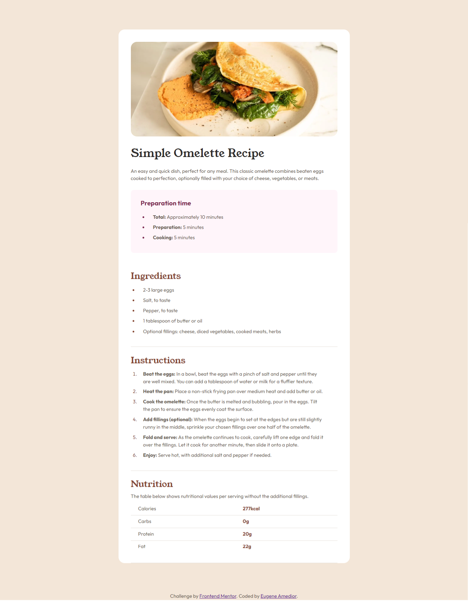

# Frontend Mentor - Recipe page solution

This is a solution to the [Recipe page challenge on Frontend Mentor](https://www.frontendmentor.io/challenges/recipe-page-KiTsR8QQKm). Frontend Mentor challenges help you improve your coding skills by building realistic projects. 

## Table of contents

- [Overview](#overview)
  - [The challenge](#the-challenge)
  - [Screenshot](#screenshot)
  - [Links](#links)
- [My process](#my-process)
  - [Built with](#built-with)
  - [What I learned](#what-i-learned)
  - [Useful resources](#useful-resources)
- [Author](#author)

## Overview

### Screenshot



### Links

- Solution URL: [Github](https://github.com/Eugene-ak/recipe-page.git)
- Live Site URL: [https://recipe-page-one-weld.vercel.app/](https://recipe-page-one-weld.vercel.app/)

## My process

### Built with

- [React](https://reactjs.org/) - JS library
- [Next.js](https://nextjs.org/) - React framework
- [Sass](https://sass-lang.com/) - For styles

### What I learned

- It turns out that when using tables in next js, all content of the table must be wrapped in a **thead** (table head) or **tbody** (table body). This is because next js does not generate those tags around table elements when not specified as is in the case of html.

- I also learned how to use local fonts in nexts js without using the css approach/variables. This is an example snippet

```js
import Outfit from "next/font/local";
import YoungSerif from "next/font/local";

export const outfit = Outfit({
  src: "./../public/assets/fonts/outfit/Outfit-VariableFont_wght.ttf",
  display: "swap"
});

export const youngSerif = YoungSerif({
  src: "./../public/assets/fonts/young-serif/YoungSerif-Regular.ttf",
  display: "swap"
});
```

I created a file called **font.ts** in my app directory and exported the fonts needed for the project. I then imported them by class names in the files where they will be needed.

```html
<html lang="en">
  <body className={outfit.className}>{children}</body>
</html>
```

### Useful resources

This is a [Next.js](https://nextjs.org/) project bootstrapped with [`create-next-app`](https://github.com/vercel/next.js/tree/canary/packages/create-next-app).

#### Getting Started

First, run the development server:

```bash
npm run dev
# or
yarn dev
# or
pnpm dev
# or
bun dev
```

Open [http://localhost:3000](http://localhost:3000) with your browser to see the result.

You can start editing the page by modifying `app/page.tsx`. The page auto-updates as you edit the file.

This project uses [`next/font`](https://nextjs.org/docs/basic-features/font-optimization) to automatically optimize and load Inter, a custom Google Font.

#### Learn More

To learn more about Next.js, take a look at the following resources:

- [Next.js Documentation](https://nextjs.org/docs) - learn about Next.js features and API.
- [Learn Next.js](https://nextjs.org/learn) - an interactive Next.js tutorial.

You can check out [the Next.js GitHub repository](https://github.com/vercel/next.js/) - your feedback and contributions are welcome!

Check out our [Next.js deployment documentation](https://nextjs.org/docs/deployment) for more details.

## Author

- Website - [Eugene K. S. Amedior](https://www.your-site.com)
- Frontend Mentor - [@Eugene-ak](https://www.frontendmentor.io/profile/Eugene-ak)
